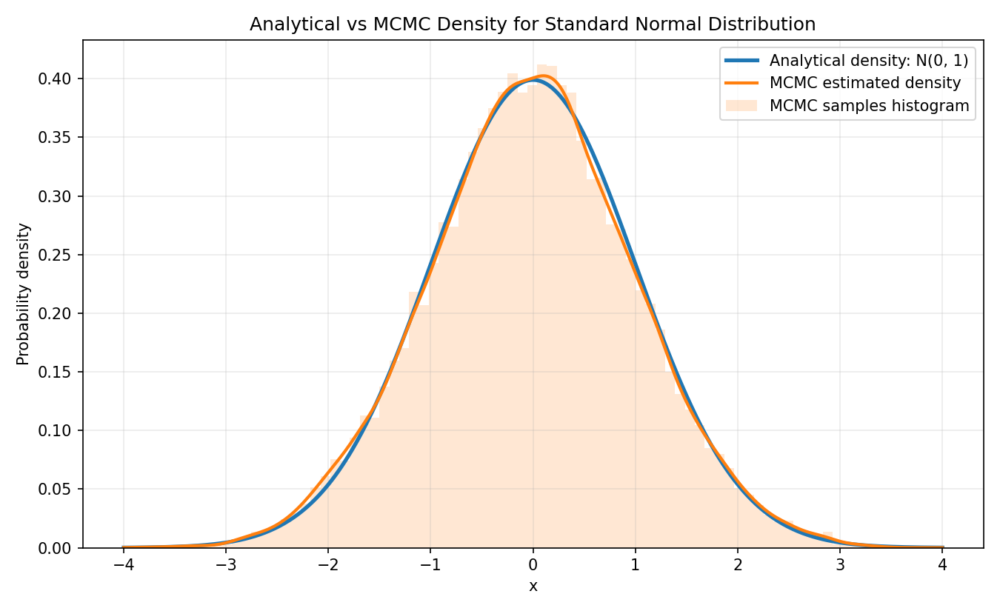

# MCMC Density Comparison

这个项目用一个常见概率分布做对照实验：标准正态分布 $N(0, 1)$。

实验目标是比较两种方式得到的概率密度图：

1. 直接解析法：使用标准正态分布的概率密度函数公式。
2. MCMC 方法：使用随机游走 Metropolis-Hastings 采样，再用核密度估计得到概率密度曲线。

最终结果会画在同一张图中，输出文件为 `normal_density_mcmc.png`。



## 文件说明

- `mcmc_density_compare.py`：主实验脚本。
- `normal_density_mcmc.png`：实验输出图。
- `requirements.txt`：运行脚本需要的 Python 包。

## 实验设置

### 目标分布

本实验选择标准正态分布：

$$
X \sim N(0, 1)
$$

其概率密度函数为：

$$
p(x) = \frac{1}{\sqrt{2\pi}}\exp\left(-\frac{x^2}{2}\right)
$$

在代码中，解析密度通过 `normal_pdf` 函数直接计算。

### 解析法

解析法在区间 $[-4, 4]$ 上生成 500 个网格点：

$$
x_1, x_2, \ldots, x_{500} \in [-4, 4]
$$

然后对每个网格点直接代入标准正态分布密度公式：

$$
p(x_i) = \frac{1}{\sqrt{2\pi}}\exp\left(-\frac{x_i^2}{2}\right)
$$

这样得到的曲线作为理论真实密度。

### MCMC 方法

MCMC 部分使用随机游走 Metropolis-Hastings 算法。

目标分布仍然是标准正态分布：

$$
\pi(x) \propto \exp\left(-\frac{x^2}{2}\right)
$$

由于 Metropolis-Hastings 只需要目标分布的比例形式，归一化常数 $\frac{1}{\sqrt{2\pi}}$ 可以省略。

实验中的提议分布为：

$$
x' = x_t + \epsilon,\quad \epsilon \sim N(0, \sigma_q^2)
$$

其中：

$$
\sigma_q = 1.0
$$

因为提议分布是对称的，即：

$$
q(x' \mid x_t) = q(x_t \mid x')
$$

所以接受概率为：

$$
\alpha = \min\left(1, \frac{\pi(x')}{\pi(x_t)}\right)
$$

代入标准正态分布的未归一化密度：

$$
\alpha
= \min\left(
1,
\frac{\exp\left(-\frac{(x')^2}{2}\right)}
{\exp\left(-\frac{x_t^2}{2}\right)}
\right)
$$

等价地，在对数空间中计算：

$$
\log \alpha
= -\frac{(x')^2}{2} + \frac{x_t^2}{2}
$$

代码中使用对数形式，避免数值下溢。

### MCMC 参数

本实验使用以下采样参数：

| 参数 | 数值 | 说明 |
| --- | ---: | --- |
| `n_samples` | 40,000 | burn-in 之后保留的样本数量 |
| `burn_in` | 5,000 | 前期丢弃样本数量 |
| `proposal_std` | 1.0 | 随机游走提议分布的标准差 |
| `random_seed` | 42 | 随机种子，保证结果可复现 |
| `grid` | 500 points in `[-4, 4]` | 绘制密度曲线的横轴网格 |

当前脚本运行得到的接受率约为：

$$
0.703
$$

### MCMC 密度估计

MCMC 得到的是样本序列，而不是解析密度函数。

因此实验中先得到样本：

$$
x^{(1)}, x^{(2)}, \ldots, x^{(n)}
$$

然后使用 Gaussian Kernel Density Estimation 估计密度：

$$
\hat{p}(x)
= \frac{1}{nh}
\sum_{i=1}^{n}
K\left(\frac{x - x^{(i)}}{h}\right)
$$

其中 Gaussian kernel 为：

$$
K(u) = \frac{1}{\sqrt{2\pi}}\exp\left(-\frac{u^2}{2}\right)
$$

带宽使用 Silverman's rule of thumb：

$$
h = 1.06 \hat{\sigma} n^{-1/5}
$$

其中 $\hat{\sigma}$ 是 MCMC 样本标准差。

## 运行方式

本项目已在 conda `base` 环境中测试通过。

```bash
/Users/avery/anaconda3/bin/python mcmc_density_compare.py
```

如果使用当前 shell 中的 conda 环境，也可以运行：

```bash
python mcmc_density_compare.py
```

运行后会在项目目录中生成：

```text
normal_density_mcmc.png
```

## 结果解释

图中包含三部分：

1. 蓝色曲线：标准正态分布的解析概率密度。
2. 橙色曲线：MCMC 样本经过 KDE 得到的密度估计。
3. 浅橙色直方图：MCMC 样本的归一化直方图。

可以看到，MCMC 估计曲线与解析曲线基本重合，说明随机游走 Metropolis-Hastings 能够正确采样目标分布。
